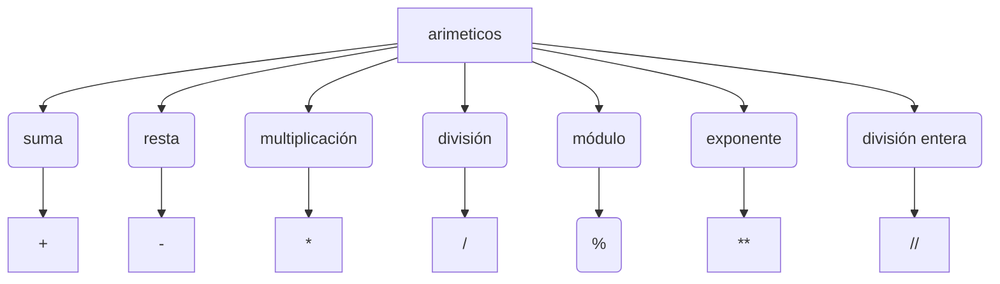
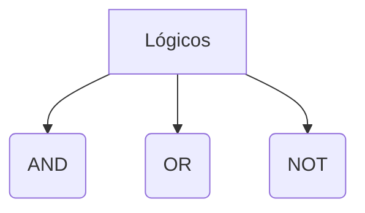
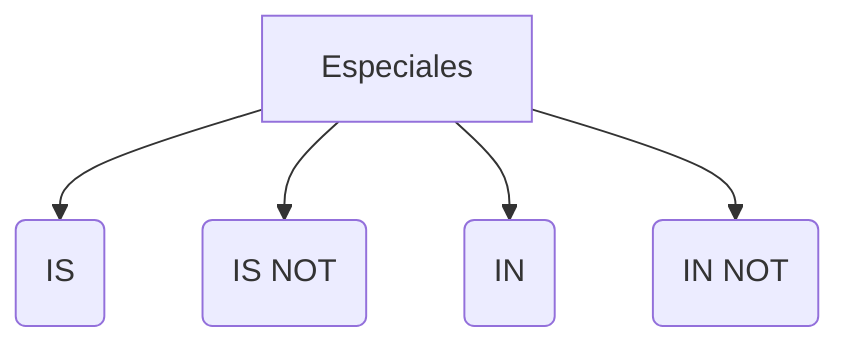

# PYTHON
Python es un lenguaje de alto nivel, porque se parece al lenguaje humano en su sintaxis.
Un lenguaje de bajo nivel es uno con muchos números, cerca del lenguaje binario (ceros y unos). 

Tiene un tipado dinamico (la formación se hace sobre la marcha) y fuerte (diferencia claramente los tipos de variable).

Una variable puede tener números, pero no puede empezar por uno, mayúscula o serpientes.

#### Reglas de cortesia:
Empezar por minúscula/Tener serpientes

## Tipos operadores


```mermaid
flowchart TD
    A[comparación] --> B(Igual que) --> =
    A[comparación] --> C(Diferente que) --> J(!=)
    A[comparación] --> D(Mayor que) --> H(>)
    A[comparación] --> E(Menor que) --> I(<)
    A[comparación] --> F(Igual o menor que) --> K(<=)
    A[comparación] --> G(Igual o mayor que) --> M(>=)
```

```mermaid
flowchart TD
    A[Asignación] --> B(igual) --> =
    A[Asignación] --> C(incremento) --> +=
    A[Asignación] --> D(decremento) --> -=
    A[Asignación] --> E(producto) --> *=
    A[Asignación] --> F(división) --> /=
    A[Asignación] --> G(resto) --> I(%=)
    A[Asignación] --> H(exponente) --> **=
    A[Asignación] --> J(cociente) --> //=
```

## Identación: 
 Las líneas identadas forman bloque con la anterior sin identar, para esto se usa la tabulación o cuatro espacios.

## Variable: 
 Espacio en la memoria del ordenador donde se almacenará un valor que podra cambiar durante la ejecución del programa.A la variable se les asigna un nombre para poder referirnos a ellas.

## Listas
- ### ¿Qué son las listas?
Estructura de datos que nos permite almacenar gran cantidd de valores. En phyton las listas pueden guardar diferentes tipos de valores. Se pueden expndir dinámicamente añadiendo nuevos elementos.
- ### Sintaxis de las listas
Las listas tienen índice(elem1: índice 0, elem2: índice 2 ...)
```Python
nombreLista=[elem1, elem2, elem3]      
print (nombreLista)  (imprime todos los elem)
print (nombreLista(1))  (imprime el de índice 1, elem2)
print (nombreLista(-1))  (imprime el 1º por el final, elem3)
```

## Estructuras de control de flujo
### Flujo de ejecución de un programa
- Programa: orden con el que se ejecucion tus instrucciones
En phyton el orden normal es de arriba a abajo.
Las estructuras condicionales pueden romper el flujo. Las condiciones a avaliar dan como resultado verdadero o falso. Si da verdadero se ejecuta el bloque, y si da falso no se ejecuta nada, rompe el flujo normal.
### Sintaxis (examen)
if (condición) operador x:
En phyton existe la funcion input() que sirve para introducir datos por el teclado. Lo que recive un imput lo transforma en datos de texto.
El ambito de una variable es la parte del programa en la que es accesible una variable.
El if puede ir acmopañado de else(y si no es verdad) que se ejecuta cuando la condicion da como resultado falso. El else siempre es compañero del if más cercano.

## Elif 
Se usa cuando tenemos que asignar muchas condiciones y todas estan integradas. Es una combinación entre if y else.

## Condicionales
Con catenación de operadores de comparación, el resultado es verdadero si todo es verdadero. 
```Python
if 0<edad>100
```
Solo se puede hacer si son de la misma medida.

##  boleanos
and, or y not son operadores boleanos.
- And: para que salga la condición verdadera tiene que salir las dos verdaderas.
- Or: sale verdadero si uno es verdadero
- Not: si es falso es verdadero
En los condicionales podemos usar también el comando in. Este sirve para comprobar si una palabra esta dentro de una secuencia.

## Bucles
Los bulces pueden ser determinados cuando sabemos cuantas veces se va a repetir, y los indeterminados son cuando se repiten una cantidad indeterminada de veces(dependen de una condicion).
Se forma por la declaracion y cuerpo del bucle. Cuando se entra en un bucle el programa no avanza hasta que se salga de el.
Cuando el elemento es una lista la variable vale los elementos de la lista por orden, y si es una cadena de texto valen sus caracteres. 
La función range develve una lista de números enteros empezando por el 0, y de tantos elementos como se le paso por el parámetro, 
o si se meten dos parámetros(el de la iqzierda tiene que ser menor), me va a devolver una cantidad de números enteros que es la resta empezando por el menor.
La función "print" es formateable, para eso lo primero dentro del paréntesis es la letra f. 
Primero empezamos con la letra f y luego podem usar varibles con substitución poniendo la variable entre paréntesis.
```Python
i =perico
print(f"buenos dias {i}")
```


### Sintaxis bucles (examen)  
for variable a recorrer in elemento a recorrer(lista, tupla, cadena de texto y rango):

### Práctca de bucle for
Introducimos una frase por texto, y creamos una funcion que me cuente cuántas vocales hay  en ese texto.

## While sintaxis (examen)
while condición:

## continue, pass y else
- Cotinue: a partir de continue no ejecuta la siguiente vuelta
- pass: a partir de pass devuelve un nule y no se ejecuta. Normalmente se emplea para evitar un error en phyton
- else: se usa para lo miso que un if

## Tuplas
Las tuplas son listas unmutables, es decir, no se pueden modificar después de su creación.
- no pernmiten añadir, eliminar o mover elementos
- permiten extraer opciones, pero el resultado es una tupla nueva
- no permiten busquedas
- si permiten comprobar si un elemnto se encuentra una tupla
- permiten índices, igual que las listas
### ventajas
- más rapidas
- menos espacio
- formatean srings
- pueden utilizarse como claves de un diccionario (las listas no)

## Diccionario
Estructura de datos que nos permiten alacenar valores de diferentes tipos e incluso listas y otros diccionarios.
La principal característica de los diccionarios es que los datos se almacena asociados a una clave de tal forma que se crea una asociación de tipo clave:valor para cada elemento alamacenado. Los elementos son referenciados por su clave. 
los elementos almacenados no están ordenados. El orden es indiferente a la hora de almacenar información. Podems usaar tulas para asignar claves. El método keys devuelve las llaves. El método values devuelve los valores. La función len devuelve la longitud
### Sintaxis
```Python
diccionario={clave1:elemento1,...}, para añadir elementos al diccionario es: 
<diccionario>[<nuevaclave>]=<nuevoelemento>, para cambiar el valor de los elementos:
<diccionario>[<clave>]=<nuevoelemento>, para borrar un elemento clave: del <diccionario>[<clave>]
```
## Split
El método split convierte una variable tipo texto a una lista(de palabras).

## Excepción
Es un error en la ejecución de un programa, aún que la sintaxis esté bien hecha.
Un mismo try sirve para comprobar varios errores.

Sino ponemos nada podemos capturar un error "general".

## Try:

<código a intentar>

Except <nombre errror>:

<código a ejecutar si hay error>

Finally:
  <código ejecuta siempre>

Para lanzar una exepción se hace lo siguiente:
if <condición>:
    raise <nombre error>("<texto de ayudas>")

## POO
Consiste en transladar la natualeza de los objetos de la vida real al código de programación.
Los objetos tienen un estado, un comportamiento, y unas propiedades.
Ventajas:
- Modularización:los programas están divididos en trozos.
- Reutilizable
- Encapsulamiento
Vocabulario:
- Clase: modelo donde se redactan las características comunes de un grupo de objetos
- Objeto
- Ejemplar de clase. Instancia de clase. Ejemplariza una clase
- Modularización: podemos coger módulos de otros programas.
- Encapsulamiento/encapsulación:  El funcionamiento interno de los objetos es indpendiente de cada uno, está encapsulado
- Herencia
- Polimorfismo

### Nomenclatura del punto
Para acceder a las propiedades(variables dentro de un objeto): <n.objeto>.<propiedad>   <n.objeto>.<métodos>()
Una clase es la idea de un objeto.
Para rear una clase la sintaxis es: class <nombreClase>():
                                             <nombProp1>=<valor>
                                             def <nombreMetodo>():

                                             <contenidoClase>
Cuando  se crea un objeto es importante crear un método construtor para crear as propieddes comunes:
def__init__(self, valor1, ...):
    self.<propiedad1>=<valor1>
Al crear el constructor se le pueden meter valores para sus propiedades.
Encapsular vale para bloquear una propiedad de la clase para que no se cambien desde fuera. A parte de encapsular propiedades se pueden encapsular métodos.
Para eso tambie colocaremos dos _ delante del nombre.
### Herencia
Sirve para crear objetos similares.
Para crear una subclase se hace así: class <nombresubclase>(<clasePadre>)
En una clase hijo podemos volver a crear un metodo (sobrescribir) que esté en la clase padre.
Podemos heredar de varias clases:  class <claseHija>(<NombreC1,> <NombreC2>, ...):
Cuidado cuando hay herencia múltiple ya que si hay métodos con el mismo nombre en las clases padres se hereda solo la del primer padre mencionado. 
Podemos solucionarlo usando la funcion super().
Super().<nombre_metodo_padre>(<p1,<p2>, ...) se usa dentro de una clase para llamar al metodo de la clase padre.
Con herencia se usa el principio de substitución. Un objeto de la subclase siempre será objeto de la superclase.
Isintance sirve para para  comprobar si una clase es hija de otra.
Si varios ejemplos tienen metodos que se llaman igual podemos crear una funcion donde se pasa como parámetro un objeto y me ejecutará el método correcto.

### Métodos de string
En python todos son objetos.
- texto.upper: convierte todo en mayúsculas
- texto.capitalice: pone la 1 letra en mayúscula
- texto.count: cuenta el número de letras
- texto.find: dice la posición de la letra
- texto.isdgit: comprueba si son solo números número 
- texto.isalum:comprueba si son letras y números
- teto.isalpha: comprueba si son solo letras
- texto.split: separa palabras 
- texto.strip:borra los espacios 
- texto.replace: cambia un caracter por otro
- texto.rfind: busca desde el final
## módulos
Un odulo es un conjunto de funciones, clase y variables. Junto a un archivo con extensión con .py, .pyc.
Se usan para organizar y reutilizar el código. Se hace creando un programa y lo guardad acabando en .py
Para usar un módulo hay que invocarlo import <nombre módulo> o from <nombre módulo> import *, y hay que importar y utilizar nomenclatura del punto.


